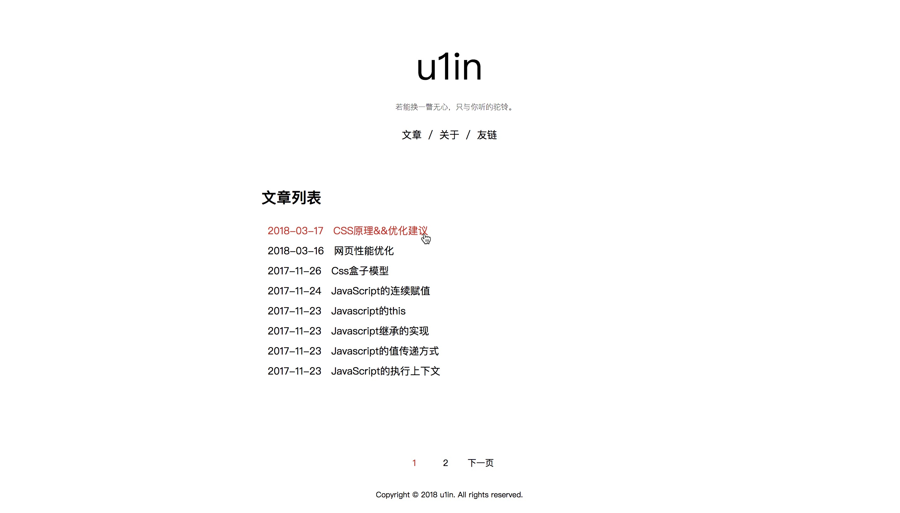

# u1in-blog

## 前言

临时摸的一个博客项目，因为懒得改别人的代码了。保留了最最精简的博客功能——markdown转html，无他。


后端使用koa2


前端模板使用nunjucks


md转html使用marked


主要文件仅有两个js和两个html。

## 使用

安装

```bash
npm install
```

运行

```bash
node start
```

文章markdown请以 **时间@标题** 命名

## 截图


